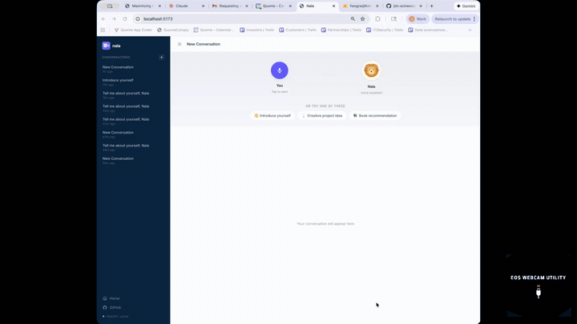

# Nala

A voice-first AI assistant that runs entirely in your browser. Talk to Nala, and she talks back — no cloud APIs, no API keys, no data leaving your device.

<p align="center">
  <a href="https://drive.google.com/file/d/1GbNv7TEwUyeWNFDvmbFm--18sj3Is3HC/view?usp=sharing">
    
  </a>
</p>

<p align="center">
  
</p>

Built with React, Express, PostgreSQL, [WebLLM](https://github.com/mlc-ai/web-llm) (browser-local LLM), and the Web Speech API.

## Features

- **Voice in, voice out** - Speak naturally, hear Nala respond aloud
- **Fully local AI** - LLM runs in your browser via WebGPU (no external API calls)
- **Conversation memory** - All chats persist in PostgreSQL across sessions
- **Animated avatar** - Lion character with lip-synced mouth animation while speaking
- **Auto-continue** - Conversation flows naturally; Nala listens again after responding
- **Say "stop"** - End a conversation hands-free with a voice command
- **Mobile responsive** - Works on desktop and mobile with adaptive layout
- **Guided onboarding** - Starter prompts help new users get started immediately

## Quick Start

The entire app runs with a single Docker command. You need [Docker](https://www.docker.com/products/docker-desktop/) installed.

```bash
git clone https://github.com/jim-schwoebel/nala-cal-poly-demo.git
cd nala-cal-poly-demo
docker compose up --build
```

Open **http://localhost:5173** in Chrome (113+ required for WebGPU).

On first load, the AI model downloads (~1-4 GB). It's cached in your browser after that.

## Architecture

```
Browser (React + Vite + TypeScript)
  ├── WebLLM         - Local LLM inference via WebGPU
  ├── Web Speech API  - Speech-to-text (mic input)
  ├── Kokoro TTS *    - Neural text-to-speech (optional)
  └── REST client     - Talks to Express API
        │
Express.js API Server (persistence only)
        │
PostgreSQL - Conversations + messages
```

*\* Kokoro TTS is opt-in via `VITE_TTS=kokoro`. Default uses the browser's built-in speech synthesis for lower latency.*

### Data Flow

1. You tap the mic and speak
2. Web Speech API converts your voice to text
3. Your message is saved to PostgreSQL
4. WebLLM generates a response locally in the browser
5. The response is saved to PostgreSQL
6. Nala speaks the response aloud (with lip-synced avatar)
7. The mic automatically re-activates for your next turn

## Project Structure

```
nala/
├── client/               # React + Vite frontend
│   └── src/
│       ├── components/   # UI components (avatar, waveform, chat, etc.)
│       ├── hooks/        # Custom hooks (voice, LLM, conversations)
│       └── services/     # API client
├── server/               # Express.js backend
│   └── src/
│       ├── routes/       # REST API endpoints
│       └── db/           # PostgreSQL connection, queries, migrations
├── shared/               # Shared TypeScript types
├── docker-compose.yml    # Run everything with one command
└── CLAUDE.md             # AI coding assistant context
```

## Development

### With Docker (recommended)

```bash
docker compose up --build
```

Source files are volume-mounted — edit code and see changes instantly via hot reload.

| Service | URL | Purpose |
|---------|-----|---------|
| Client | http://localhost:5173 | React app (Vite dev server) |
| Server | http://localhost:3001 | Express API |
| Database | localhost:5432 | PostgreSQL |

### Without Docker

Prerequisites: Node.js 20+, PostgreSQL 14+

```bash
# Install dependencies
npm install

# Set up database
createdb nala
psql nala -f server/src/db/migrations/001-initial-schema.sql

# Start server (terminal 1)
cd server && npm run dev

# Start client (terminal 2)
cd client && npm run dev
```

### Running Tests

```bash
# Client tests (all 38 pass)
npm run test:client

# Server tests (requires PostgreSQL)
createdb nala_test
cd server && DATABASE_URL=postgresql://localhost:5432/nala_test npx vitest run
```

## Configuration

| Environment Variable | Default | Description |
|---------------------|---------|-------------|
| `VITE_TTS` | *(unset)* | Set to `kokoro` for neural TTS voice (higher quality, slower first load) |
| `DATABASE_URL` | `postgresql://localhost:5432/nala` | PostgreSQL connection string |
| `PORT` | `3001` | Express server port |
| `API_URL` | `http://localhost:3001` | Backend URL for Vite proxy (Docker sets this automatically) |

## Browser Requirements

- **Chrome 113+** (required for WebGPU)
- Microphone access (prompted on first use)
- ~2-4 GB free memory for the LLM model

Firefox and Safari do not yet support WebGPU and will not work.

## Tech Stack

| Layer | Technology | Purpose |
|-------|-----------|---------|
| Frontend | React 18, Vite 5, TypeScript | UI framework |
| AI | WebLLM (Llama 3.1 8B) | Browser-local LLM |
| Speech Input | Web Speech API | Voice-to-text |
| Speech Output | Web Speech API / Kokoro TTS | Text-to-voice |
| Visualization | Canvas API | Animated waveform orb |
| Avatar | SVG + requestAnimationFrame | Lion with lip sync |
| Backend | Express.js, TypeScript | REST API (persistence only) |
| Database | PostgreSQL 16 | Conversation storage |
| DevOps | Docker Compose | One-command setup |

## Tutorial: Building Nala from Scratch with Claude Code

This project was built live in a single Claude Code session (~2 hours) as a tutorial for Cal Poly Pomona's hackathon. Below is the step-by-step process so you can replicate it for your own projects.

<p align="center">
  <a href="https://drive.google.com/file/d/1GbNv7TEwUyeWNFDvmbFm--18sj3Is3HC/view?usp=sharing">
    
  </a>
</p>

### Prerequisites

- Install [Claude Code](https://claude.ai) (`npm install -g @anthropic-ai/claude-code`)
- Install [Docker](https://www.docker.com/products/docker-desktop/)
- A GitHub account with the [GitHub CLI](https://cli.github.com/) (`gh`) installed

### Phase 1: Setup (~2 min)

Create a project directory, initialize git, and launch Claude Code:

```bash
mkdir nala && cd nala
git init
claude
```

Install the **superpowers** plugin inside Claude Code — it dramatically improves planning and spec quality:

```
/plugin superpowers
/reload-plugins
```

### Phase 2: Write a CLAUDE.md File (~3 min)

CLAUDE.md is like long-term memory for Claude. It tells Claude what you're building, your tech stack, coding conventions, and file structure. Give Claude a prompt like:

> "Create a CLAUDE.md file for this project. We're building Nala — a voice assistant web app. Stack: React + Vite + TypeScript frontend, Express.js backend, PostgreSQL for conversation memory, Web Speech API for browser-native voice input/output."

Structure it with **WHAT** (overview), **WHY** (design decisions), and **HOW** (coding standards). This keeps Claude focused across long sessions and prevents it from going off-track.

### Phase 3: Design the Architecture (~15 min)

This is the most important step. Use the superpowers design skill:

> "Use superpowers to design: Design the complete architecture for Nala. I need PostgreSQL schema, API endpoints, React component tree, and data flow."

Superpowers treats you like a colleague — it asks clarifying questions one at a time:
- "Should you have a users table with no auth, or full authentication?"
- "How many messages should be stored for context?"
- "When should the waveform display — recording only, or also while thinking?"
- "Monorepo or separate repos?"

Answer each question. The back-and-forth takes ~10 minutes but produces a comprehensive design spec saved to `docs/superpowers/specs/`. This spec is the foundation for everything that follows.

**Key insight:** If you skip this step and go straight to coding, you'll take side roads. As Jim put it in the session: *"You can run a marathon, but if you don't know the direction you're headed, you might land in a forest and not the ocean."*

### Phase 4: Generate the Implementation Plan (~10 min)

Once the spec is approved, say:

> "Approved, please proceed toward implementation."

Claude writes a detailed implementation plan with 18 bite-sized tasks — each with exact file paths, code, test commands, and commit messages. The plan is saved to `docs/superpowers/plans/` and goes through a review loop before execution.

### Phase 5: Execute the Plan (~30 min)

Choose **subagent-driven development** when prompted. Claude dispatches a fresh subagent for each task, reviews between tasks, and commits after each one:

1. Project scaffolding (monorepo, workspaces, configs)
2. Database schema + migrations + query functions
3. Express API routes (conversations, messages)
4. Client API service
5. React hooks (conversations, messages, WebLLM, voice I/O, audio analyser)
6. UI components (chat history, sidebar, waveform, mic button, model loader)
7. App shell wiring everything together

Each task follows TDD: write the test, verify it fails, implement, verify it passes, commit. You can let this run and go make coffee — it will ask if it hits a blocker.

### Phase 6: Containerize (~5 min)

Instead of installing PostgreSQL locally, containerize everything:

> "Can you just containerize this application and put Postgres as a Docker container and have the whole app be a container?"

Claude writes a `docker-compose.yml` with three services (db, server, client), volume mounts for hot reload, and auto-migration. One command to run: `docker compose up --build`.

### Phase 7: Iterate on UX (~30 min)

This is where the magic happens. Use the app, notice what feels wrong, and tell Claude in natural language:

> "The sessions should auto-record after the AI responds so I don't have to keep clicking. When I say 'stop', it should stop the conversation. The visualization isn't engaging enough. I had trouble knowing what to say initially."

Claude implements all four changes in one shot. Keep iterating:

- **"Do a UX audit and suggest 3-5 improvements"** — Claude reads all your code, identifies 40+ issues, and recommends the highest-impact fixes
- **"Make it look like Stripe"** — redesigns the sidebar with Stripe's color palette, typography, and spacing
- **"Make Nala an avatar like from the Lion King with lip sync"** — creates an SVG lion with animated mouth driven by `requestAnimationFrame`
- **"The text-to-speech is too robotic"** — swaps Web Speech API for Kokoro TTS (82M neural model running in-browser)

### Phase 8: Work in Parallel

While the code is building, open another terminal and have Claude work on other things simultaneously:

```bash
# Terminal 1: Building the app (takes 30+ min)
claude  # executing the implementation plan

# Terminal 2: Documentation (takes 5 min)
claude  # "Create marketing docs, user personas, competitive analysis"

# Terminal 3: Security (takes 5 min)
claude  # "Write a security audit with OWASP ASVS assessment and threat model"
```

Documentation and audits complete much faster than code and don't interfere with each other.

### Phase 9: Ship (~5 min)

Write a README, add a license, and push:

> "Document everything with a README on how to get this setup. Assume Apache 2.0 license. Encourage public contributions."

Push to GitHub:

> "Commit and push to GitHub."

### Tips from the Session

- **Commit early and often** — remind Claude to commit. You can always revert if something breaks
- **Plan before you code** — a 15-minute spec saves hours of side roads
- **Use superpowers for everything** — design, implementation, UX audits, docs
- **Paste errors directly** — when something breaks, paste the error into Claude and it will debug
- **Think in swim lanes** — code in one terminal, docs in another, security in a third
- **Feature flags for experiments** — keep both options (e.g., `VITE_TTS=kokoro`) instead of replacing
- **Security matters** — run an automated OWASP audit even for hackathon projects
- **Ship your code** — version control everything in GitHub so you never lose work

### Session Stats

| Metric | Value |
|--------|-------|
| Total time | ~2 hours |
| Commits | 35+ |
| Lines of code | ~5,000+ |
| Test files | 13 (38 tests passing) |
| Docker services | 3 (client, server, db) |
| Parallel Claude sessions | 3 |

## Contributing

We welcome contributions! See [CONTRIBUTING.md](CONTRIBUTING.md) for guidelines.

Quick version:
1. Fork the repo
2. Make your changes
3. Run tests: `npm run test:client`
4. Open a PR

Check [open issues](https://github.com/jim-schwoebel/nala-cal-poly-demo/issues) for ideas on what to work on.

## License

[Apache 2.0](LICENSE)
